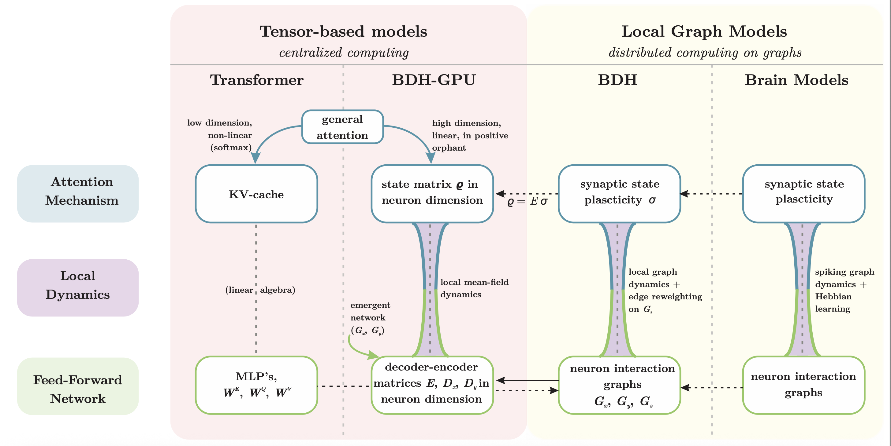
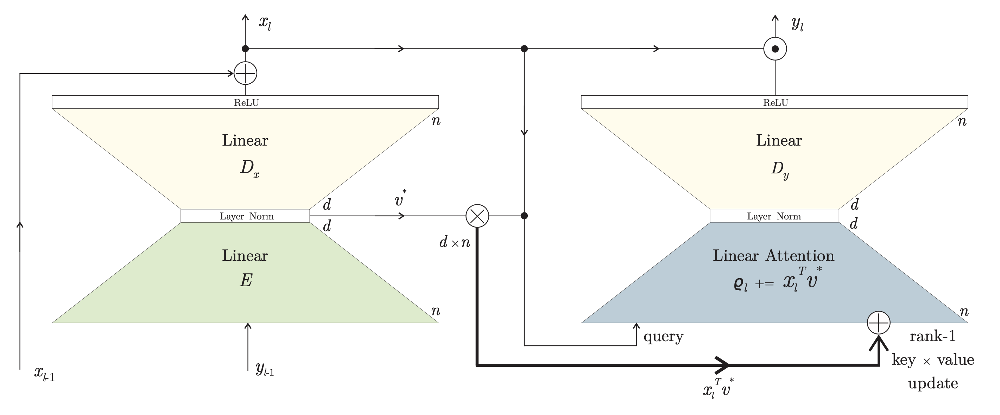
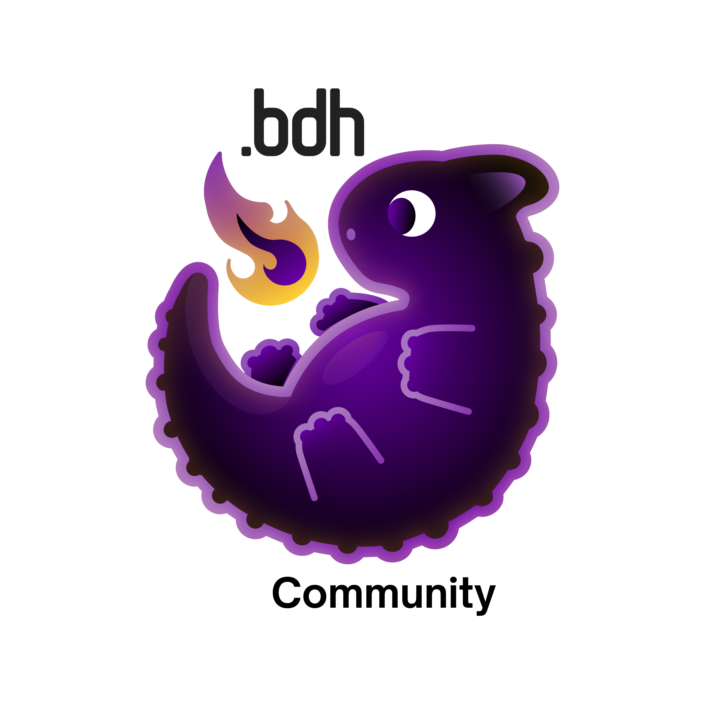

# burn_dragon 🔥🐉🐣

[](https://github.com/Mosure/burn_dragon/actions?query=workflow%3Atest)
[](https://raw.githubusercontent.com/mosure/burn_dragon/main/LICENSE)
[](https://crates.io/crates/burn_dragon)


burn inference and training of the [dragon model](https://arxiv.org/abs/2509.26507)






## current state

This repository is now organized as a generic Dragon framework with curated library-facing APIs:

- root facade: `burn_dragon::api`
- core Dragon concepts: `burn_dragon_core::api`
- fused execution layer: `burn_dragon_wgpu::api`
- checkpoint/deployment helpers: `burn_dragon_checkpoint::api`
- shared stream semantics: `burn_dragon_stream::api`
- multimodal composition: `burn_dragon_multimodal::api`
- domain adapters:
  - `burn_dragon_language::api`
  - `burn_dragon_vision::api`
  - `burn_dragon_graph::api`
  - `burn_dragon_sudoku::api`

Lower-level surfaces remain available for advanced use through `::api::expert::*`, but they are
not the recommended entrypoint.

Framework status/tracking:

- [framework support matrix](./docs/dragon_framework_support_matrix.md)
- [Dragon Hatchling alignment spec](./docs/dragon_hatchling_alignment_spec.md)
- [Dragon Hatchling progress tracker](./docs/dragon_hatchling_progress_tracker.md)
- [Dragon mHC roadmap](./docs/dragon_mhc_core_roadmap.md)
- [Dragon multimodal VL-JEPA roadmap](./docs/dragon_multimodal_vl_jepa_roadmap.md)
- [Dragon multimodal progress tracker](./docs/dragon_multimodal_progress_tracker.md)

## features

- [x] cached inference
- [x] training benchmarks and reporting
- [x] [pope](https://arxiv.org/abs/2509.10534v1) positional embeddings
- [x] wasm deployments
- [x] burnpack multipart deployment + streamed web initialization
- [x] native burnpack bootstrap/cache helpers
- [x] sparsity metrics and visualization
- [x] vision dragon [cortical column/stack](https://arxiv.org/abs/2412.18354)
- [x] recurrent, foveated saccade training and inference
- [x] [GDPO](https://arxiv.org/abs/2601.05242)
- [x] fused recurrent, local-grid, structured-pyramid, and sparse-graph kernels
- [x] topology-agnostic structured recurrent state contracts
- [x] graph recurrent adapters with compiled execution
- [x] manifold constrained hyper-connections (experimental core integration)
- [ ] adaptive tool discovery
- [ ] conditional (deep) gating
- [ ] document-coherent dataloading and scale mixup
- [ ] episodic memory
- [ ] hierarchical, memory-aware recurrent state
- [ ] mixture-of-expert routing
- [x] payload-agnostic stream/TBPTT crate
- [x] multimodal VL-JEPA composition foundation
- [ ] neuromorphic backend
- [ ] streaming, sparse synaptic backpropagation
- [ ] temporal neuron dampening


Dataset configuration (built-in presets and Hugging Face examples) is documented inline in `config/language/base.toml`.

## library quickstart

Compile-checked examples:

- [examples/core_bdh_api.rs](./examples/core_bdh_api.rs)
- [examples/vision_pyramid_api.rs](./examples/vision_pyramid_api.rs)
- [examples/vision_encoder_export_api.rs](./examples/vision_encoder_export_api.rs)
- [examples/stream_api.rs](./examples/stream_api.rs)
- [examples/multimodal_vl_jepa_api.rs](./examples/multimodal_vl_jepa_api.rs)
- [examples/multimodal_export_api.rs](./examples/multimodal_export_api.rs)
- [examples/graph_compiled_executor_api.rs](./examples/graph_compiled_executor_api.rs)
- [examples/graph_export_api.rs](./examples/graph_export_api.rs)
- [examples/language_export_api.rs](./examples/language_export_api.rs)
- [examples/sudoku_export_api.rs](./examples/sudoku_export_api.rs)

Typical imports:

```rust
use burn_dragon::api::core;
use burn_dragon::api::checkpoint;
use burn_dragon::api::stream;
use burn_dragon::api::multimodal;
use burn_dragon::api::vision;
use burn_dragon::api::graph;
```

Use `burn_dragon::api::expert::*` only when you need lower-level compiled plans or internal
layout/kernel details.

## deployment checkpoints

The shared deployment/checkpoint crate is [burn_dragon_checkpoint](./crates/burn_dragon_checkpoint).

Recommended deployment path:

- export model weights as burnpack (`.bpk`)
- optionally split them into `*.bpk.parts.json` + `*.bpk.part-*` shards for web/CDN delivery
- load them through the shared multipart helpers, the native bootstrap/cache helpers, or the web
  `loadModelFromUrl(...)` path

Current status:

- multipart burnpack loading is shared and supported
- shared burnpack bundle export helpers are supported
- streamed web initialization is supported
- native cache/bootstrap resolution for remote burnpack bundles is supported in the shared checkpoint crate
- monolithic-or-parts burnpack loading is supported in CLI inference
- language/BDH checkpoint export is supported in CLI through `export_burnpack`
- vision encoder checkpoint export is supported in CLI through `export_burnpack` for `distill`, `lejepa`, and `video_lejepa`
- sudoku checkpoint export is supported in CLI through `export_burnpack`
- graph checkpoint export is supported in CLI through `export_burnpack`
- multimodal VL-JEPA checkpoint export is supported in CLI through `export_burnpack`
- exporters currently expect checkpoints recorded by the current Burn runtime/layout used by this repository
- multimodal VL-JEPA runtime/config/export support now covers image-text and video-text composition on top of the shared stream crate
- the main remaining gaps are broader vision/video wrappers beyond encoder-style export and true deployment quantization beyond float downcast

Example language deployment export:

```bash
cargo run -p burn_dragon_cli --features train,web --bin export_burnpack -- \
  --family language \
  --checkpoint runs/<run>/checkpoint \
  --epoch 1 \
  --parts-mib 64
```

Example graph deployment export:

```bash
cargo run -p burn_dragon_cli --features train,web --bin export_burnpack -- \
  --family graph \
  --checkpoint runs/graph/<run>/checkpoint \
  --epoch 1 \
  -c config/graph/<config>.json \
  --parts-mib 64
```

Example vision encoder deployment export:

```bash
cargo run -p burn_dragon_cli --features train,web --bin export_burnpack -- \
  --family vision-encoder \
  --checkpoint runs/vision/<run>/checkpoint \
  --epoch 1 \
  -c config/vision/distill/<config>.toml \
  --parts-mib 64
```

The `vision-encoder` family exports the student `VisionDragon` encoder from the supported vision
training wrappers, including `distill`, `lejepa`, and `video_lejepa`.

Example multimodal VL-JEPA deployment export:

```bash
cargo run -p burn_dragon_cli --features train,web --bin export_burnpack -- \
  --family multimodal-vl-jepa \
  --checkpoint runs/multimodal/<run>/checkpoint \
  --epoch 1 \
  -c config/multimodal/<config>.toml \
  --parts-mib 64
```

Example multimodal VL-JEPA training config chains:

```bash
# reproducible low-budget image-text smoke
cargo run -p burn_dragon_cli --features train --bin train -- \
  multimodal \
  -c config/multimodal/mnist_label_text_smoke.toml \
  --backend wgpu

# reproducible low-budget video-text smoke
cargo run -p burn_dragon_cli --features train --bin train -- \
  multimodal \
  -c config/multimodal/mnist_video_label_text_smoke.toml \
  --backend wgpu
```

Tracked real runs on the current codepath:

- image-text MNIST-label-text smoke: `runs/multimodal/wgpu/fat-operation`
- video-text centered-MNIST-label-text smoke: `runs/multimodal/wgpu/verdant-wealth`

The cheap centered-MNIST video smoke is the current recommended reproducible multimodal video
benchmark. The Moving-MNIST label-text path remains available as a harder temporal benchmark, but
it is not the recommended low-budget validation target today.

Example sudoku deployment export:

```bash
cargo run -p burn_dragon_cli --features train,web --bin export_burnpack -- \
  --family sudoku \
  --checkpoint runs/sudoku/<run>/checkpoint \
  --epoch 1 \
  --parts-mib 64
```

## training

- `cargo run -p burn_dragon_cli --release` (defaults to the cuda backend)


## inference

- `cargo run -p burn_dragon_cli --bin infer -- --max-tokens 2048 --streaming`


## benchmarks

- `cargo bench -p burn_dragon --features train,benchmark` (executes both wgpu and cuda benchmarks)
- open `target/criterion/report/index.html`


## compatible burn versions

| `burn_dragon` | `burn` |
| :--                     | :--    |
| `0.4`                   | `0.21.0-pre.2` |
| `0.2`                   | `0.19` |
| `0.1`                   | `0.18` |


## license
licensed under either of

 - Apache License, Version 2.0 (http://www.apache.org/licenses/LICENSE-2.0)
 - MIT license (http://opensource.org/licenses/MIT)

at your option.


## contribution

unless you explicitly state otherwise, any contribution intentionally submitted
for inclusion in the work by you, as defined in the Apache-2.0 license, shall be dual licensed as above, without any
additional terms or conditions.



